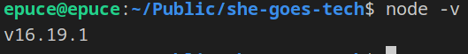
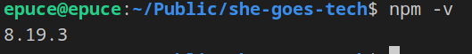

## Install node + npm
* Download from [link](https://nodejs.org/en/download/)
* restart vscode and check within the terminal if the program is being recognized
```bash
node -v
```

```bash
npm -v
```


## Vue 3
* Installation
  * direct link - `<script src="https://unpkg.com/vue@3/dist/vue.global.js"></script>`
  * node package manager 
    * `npm install -g @vue/cli` to have the command line interface
    ```bash
    vue create my-vue-app-name
    <!-- Select 1. option in when asked -->
    cd my-vue-app-name
    npm run serve
    ```
    * `npm install vue` to use the framework with a direct import within html
    ```HTML
    <script src="node_modules/vue/dist/vue.js"></script>
    ```

```HTML
<!-- ./components/MainView.vue -->
<template>
    <div>
        test
        <h1>{{ heading }} {{ clickCount || '' }}</h1>

        <button v-on:click="addCount">Add one</button>

        <MyBtn text="This is my btn"></MyBtn>
    </div>
</template>

<script>
import { defineComponent, ref } from 'vue';
import MyBtn from './MyBtn.vue';

export default defineComponent({
    components: {
        MyBtn,
    },
    setup() {
        var heading = 'This is how Vue binds data to html';
        var clickCount = ref(0);
        var addCount = function() {
            clickCount.value ++;
        }

        return {
            heading,
            clickCount,
            addCount,
        }
    }
})
</script>
```

```HTML
<!-- ./components/MyBtn.vue -->
<template>
    <span>
      <button v-on:click="changeText">{{ text }}</button>

      {{ extraText }}
    </span>
</template>

<script>
import { defineComponent, ref } from 'vue';

export default defineComponent({
    props: {
        text: {
            type: String,
            default: ''
        },
    },
    setup() {
        var extraText = ref('');
        var changeText = function () {
            this.extraText = "The btn was clicked"
        }

        return {
            changeText,
            extraText,
        }
    }
})
</script>
```

### Other JS framework
* React
* Angular
* Ember
* Backbone
* etc.

### CMS
* WordPress - most popular and widely used
* Joomla
* PrestaShop - A good setup for shop creation
* etc.

### Web based solutions
* Wix
* Squarespace
* etc.
  

# React vs Vue vs Angular


1. Create a new component TaskVueIntro.vue
2. Import the component within MainView.vue so it can be rendered
3. Within TaskVueIntro.vue add two buttons that when clicked
    1. One button changes it's text to from `Click me` to `Clicked`
    2. The other button shows a new popup component TaskVueIntroPopup.vue
        1. The popup has text `You did it` passed in as a prop
        2. Make it so that when the popup is closed the parent component changes the button background color to red