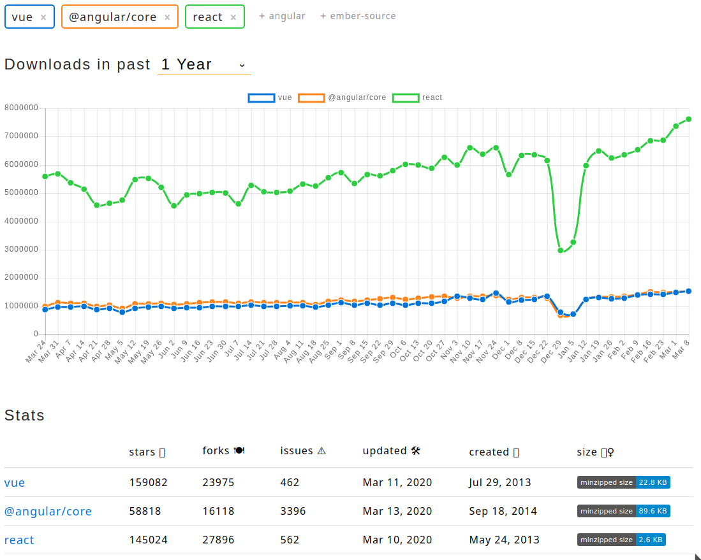

## Vue
* Installation
  * direct link - `<script src="https://cdn.jsdelivr.net/npm/vue/dist/vue.js"></script>`
  * node package manager - npm install vue
    * import the file as you would any other. `node_modules/vue/dist/vue.js` file

* vue specific commands start with "v-"
  * v-bind:title
  * v-on:click
  * v-model
* examples - [link](https://vuejs.org/v2/examples/svg.html) 

* Fiddle - [link](https://jsfiddle.net/boilerplate/vue)

```HTML
<div id="body-wrapper">
  <h1>{{ heading }} {{ clickCount || ''}}</h1>

  <button v-on:click="addCount">Add one</button>

  <my-btn text="This is my btn"></my-btn>
</div>
```
```JavaScript
Vue.component('my-btn', {
  props: {
    text: {
      type: String,
      default: ''
    },
  },
  methods: {
    changeText: function() {
      this.extraText = "The btn was clicked"
    }
  },
  data() {
   return {
       extraText: ""
   };
  },
  template: `
    <span>
      <button v-on:click="changeText">{{ text }}</button>

      {{ extraText }}
    </span>
  `
})

new Vue({
  el: '#body-wrapper',
  data: {
    heading: 'This is how Vue binds data to html',
    clickCount: 0
  },
  methods: {
    addCount: function() {
    	this.clickCount ++;
    }
  }
})
```

### Other JS framework
* React
* Angular
* Ember
* Backbone
* etc.

### CMS
* WordPress - most popular and widely used
* Joomla
* PrestaShop - A good setup for shop creation
* etc.

### Web based solutions
* Wix
* Squarespace
* etc.
  

# React vs Vue vs Angular


## Create a re-usable vue component that's displayed in the next image
