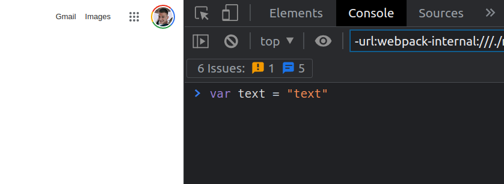

# JavaScript Data types
    JavaScript is the brain behind most of web page actions, usability, visual transformation, interaction
## JS console
    Browsers DevTools part that allows to communicate with the browser, web page, debug or test your code 
    
    All examples can be tested out in the browser console

    right click anywhere on any site, then click inspect


## Data types
All data types have their built in functions to convert them to a different type or some conditional possibilities (looping, getting some descriptive values, etc.)
* String - any text that is defined as one, usually set a characters between "" or ''; 

```JavaScript
var example = "This is a string";
```

* Number - integer of float type, positive or negative; 

```JavaScript
var example = 3.14;
```

* Array - data collection placed in a list
    * the data specified in the list can be any type
    * It's defined as any data between [] and separated with a comma
    * The data is tracked by index, where the first one is 0

```JavaScript
var example = ['test', true, [1, 2, 3], null];
```

* Object - same as array, only the index is specified
    * The data sets is a key -> value sequence 
    * It's defined as the key -> value pairs between {}

```JavaScript
var example = {key: "value", test: 123, another_object: {name: "Ed"}};
```

* Function - not a static value, but an action group that executes some activities that return a value (if no return value stated, it is treated ad undefined). There can be defined or anonymous functions. 

```JavaScript
// Function with a variable reference to it
function sayHello() { 
    alert("Hello");
}

// Anonymous function
$('button').on('click', function() {
    console.trace('Im anonymous');
})
```

* Boolean - describes positive (true) or negative (false) value (condition)
    * There are values that also are treated as true or false
        * falsely - 0, '' (empty string), null, undefined, NaN
        * truly - not empty strings, all numbers except zero, arrays, objects, functions, etc.

```JavaScript
var example = true;
```

* null, undefined, NaN - depending on the use all these values ar treated as false, so then what's the difference?
    * null - always stated as a non existing value from the user, or just a fallback if nothing assigned
    ```JavaScript
    let test = null;
    ```
    * undefined - the variable has been stated, but no value has been assigned;
    ```JavaScript
    let test;
    console.log(test) // Logs undefined to the console
    ```
    * NaN - Not-A-Number, this is set when a mathematical action has to be performed but he passed values can't be used 
    ```JavaScript
    "string" * 10 // This actions returned value is NaN
    ```

## Variables
* var - old variable declaration (before ES6 standard introduction), can be accessed depending on the scope it was declared. Can be overwritten in a lower level scope

```JavaScript
var name = "Ed";

function newFunction() {
    var age = 55;

    console.log(age); // logs 55 to the console
}

console.log(age); // age not defined

var name = "Alex";
name = "Jim";
```

* let - blok (scope) level declaration, can't be re-declared on the same level, does not interfere with other block levels

```JavaScript
let name = "Ed";

function newFunction() {
    let  age = 55;

    console.log(age); // logs 55 to the console
}

console.log(age); // age not defined

let name = "Alex"; // ERROR
name = "Jim";

function newFunction() {
    let  name = "male"; // re-declared in a different scope
}
```

* const - can't be updated or re-declared

``` JavaScript
const name = "Ed";
name = "Jim"; // Error, already declared

const person = {
    name: "Ed",
    age: 55
}

person.name = "Alex"
```
1. **var** declarations are globally scoped or function scoped while **let** and **const** are block scoped.

2. **var** variables can be updated and re-declared within its scope; **let** variables can be updated but not re-declared; **const** variables can neither be updated nor re-declared.

3. They are all hoisted to the top of their scope but while **var** variables are initialized with **undefined**, **let** and **const** variables are not initialized.

4. While **var** and **let** can be declared without being initialized, **const** must be initialized during declaration.

### Checkup
1. Create a variable and assign a **string** to it
2. Create a variable and assign a **number** to it
3. Create a variable and assign a **boolean** to it
4. Create a variable and assign a **array** with 5 different items in it
5. Create a variable and assign a **object** with 2 key => value pairs
6. Create a variable with **undefined** type
7. Create a variable with **null** value
8. Create a variable with **NaN** value


```JavaScript
// How to test
console.log(typeof variable) // logs the type of the variable to the console

// Example
console.log(typeof Math.PI) // logs "number" to the console
```
 
 ### Conditions

* if/else is/else
```JavaScript
if (true) {
    // Run this code if the condition is tru
} else if (true) {
    // Run this code if the first is false and the second is true
} else {
    // Run this in any other case when the first two are falss
}

// Shorthand for if/else
true ? "If true, execute this code" : "If false, execute this code";

// One line if statement with no {}
if (true) "Do something";
```

* switch
```JavaScript
switch(item) {
    case "this_value":
    // Do something
    break;
    case "other_value":
    // Do this
    break;
    default:
    // Do this if no exact item
    break;
}
```

* AND / OR / reverse conditioning / comparison
```JavaScript
// comparison (strict)
true === true // Yes (true); === tests if values and data types are equal
true !== true // No (false); !== tests if values and data types are not equal

// comparison (not-strict)
true == true // Yes (true); == tests if values are equal
true == "true" // No (false);
100 == "100" // Yes (true)es;

// number1 > number1
100 > 90 // Yes (true); > tests if one number is bigger than the other
// number1 <= number1
90 <= 90 // Yes (true); <= or >= tests if on number is bigger or the same as the other one

// AND statement: &&
true && true // Yes (true)
true && false // No (false)
false && false // No (false)

// OR statement: ||
true || true // Yes (true)
true || false // Yes (true)
false || false // No (false)

// reverse conditioning
!true // No (false)
!false // Yes (true)
!(10 > 0 && 10 < 15) //No (false); the inner is true && true === true and then we reverse the true result and get false in the end
```