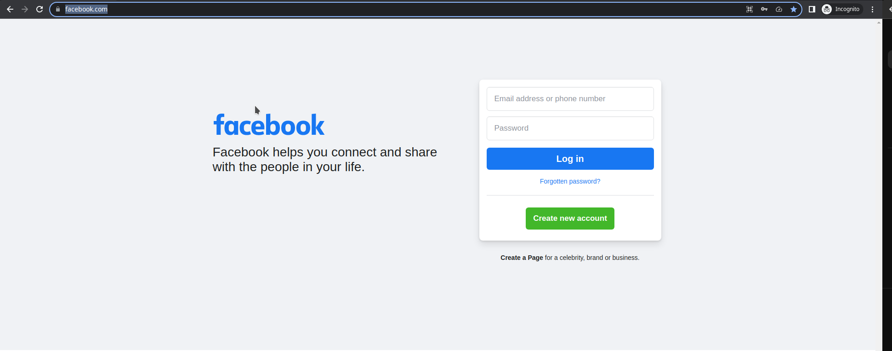
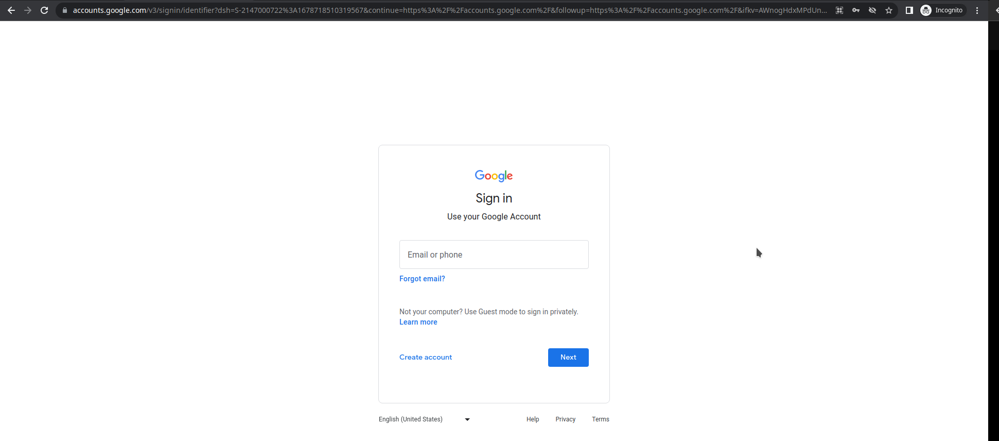
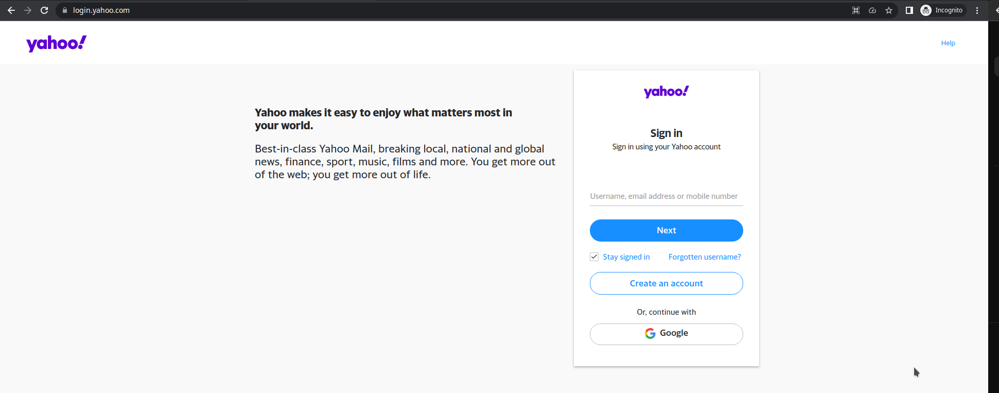
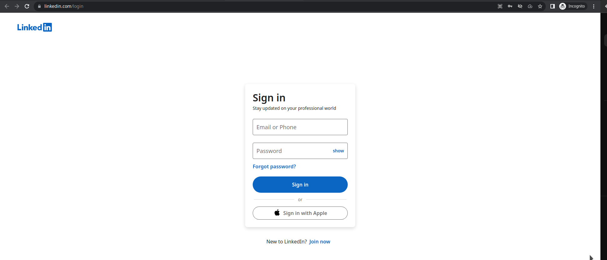

## HTML and CSS task
### add a new files named task-html-and-css.html task-html-and-css.css where the UI will be recreated

* Chose ONE of the fallowing 4 examples and try to re-create it as close a possible.
* Only HTML and CSS (can use bootstrap if preferred) is needed to replicate the UI
* All 4 are about he same complexity
* You can open any of the examples within a private window to not have your personal data shown or be redirected

## 1. `facebook homepage for login`
* https://www.facebook.com/

## 2. `Googles login page`
* https://accounts.google.com/

## 3. `Yahoo login page`
* https://login.yahoo.com/

## 4. `Linkedin login page`
* https://www.linkedin.com/login

